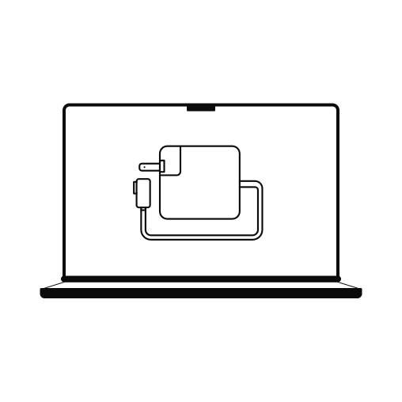

# MagSafe Watch



MagSafe Watch is a small macOS app that watches for external power loss. When the
Mac switches from a power adapter to battery and still appears to be at your
desk, it plays a sound and posts a local macOS notification.

The app uses the macOS power-source APIs directly:

- `IOPSNotificationCreateRunLoopSource` tells the app when power changes
- `IOPSGetProvidingPowerSourceType` reports Power Adapter vs Battery

For accidental-unplug detection it then samples accelerometer-like HID sensor
events, when the Mac model exposes them to user-space apps:

- external power is lost and the Mac stays motionless: alert
- external power is lost and the Mac is picked up or moved: suppress the first alert
- if no motion sensor is available, fall back to idle-time detection
- recent external keyboard or mouse input can count as desk activity, so the app
  can still alert while you are actively using the Mac at your desk
- recent built-in keyboard or trackpad input is treated as more likely intentional
  laptop use and can suppress the fallback alert
- repeat reminders continue while the Mac remains on battery and motionless

## Build

```bash
./scripts/build_app.sh
```

The app bundle is written to:

```text
outputs/MagSafe Watch.app
```

To build a local macOS installer package:

```bash
./scripts/build_installer.sh
```

The installer is written to:

```text
outputs/MagSafe Watch Installer.pkg
```

## Run

Open the app bundle. An introduction window appears, and macOS will ask for
notification permission the first time.

The window has separate pages:

- Intro: explains what the app does and how it decides whether an unplug looks accidental
- Settings: switches for monitoring, motion detection, idle fallback, external input detection, and repeat reminders
- Notifications: switches for macOS banners, alert sound, and webhook push alerts
- Permissions: guided buttons that request notification permission and open the relevant macOS System Settings panes
- Status: current power source, idle time, latest motion result, input source, and update status

You can close the window after launch. The menu-bar bolt icon keeps running and
has:

- MagSafe.watch
- Monitoring On/Off
- Notifications
- Settings
- Current MagSafe and battery status

Presentation settings:

- Show MagSafe Watch in the menu bar: enables the menu-bar item for menu-bar app use
- Show MagSafe Watch in the Dock: controls whether the app also appears as a normal Dock app

At least one of these remains enabled so the app is not left running with no
visible way to reopen it.

## Permissions

MagSafe Watch needs notification permission before it can show macOS banners.
Input Monitoring may also be needed if you enable external keyboard/mouse
activity as a desk-use signal. The app's Permissions tab includes buttons to:

- request notification permission
- open Notification Settings
- open Input Monitoring
- open Privacy & Security
- open Login Items for optional launch-at-login setup

To start it automatically at login:

```bash
./scripts/install_login_item.sh
```

## Concept And Settings

The full product concept, detection model, and known limitations are documented
in [docs/CONCEPT.md](docs/CONCEPT.md).

The app creates a config file at:

```text
~/Library/Application Support/MagSafeWatch/config.json
```

Example:

```json
{
  "monitorEnabled": true,
  "motionDetectionEnabled": true,
  "idleFallbackEnabled": true,
  "externalInputDeskSignalEnabled": true,
  "repeatRemindersEnabled": true,
  "localNotificationsEnabled": true,
  "soundEnabled": true,
  "webhookNotificationsEnabled": false,
  "autoUpdateChecksEnabled": true,
  "stationaryIdleThresholdSeconds": 90,
  "motionSampleWindowSeconds": 10,
  "inputActivityWindowSeconds": 15,
  "movementThresholdG": 0.08,
  "repeatAlertIntervalSeconds": 300,
  "updateCheckIntervalHours": 24,
  "updateFeedURL": "",
  "webhookURL": ""
}
```

`movementThresholdG` is the accelerometer vector-change threshold. Lower values
make movement detection more sensitive; higher values make it less sensitive.

Set the same `webhookURL` on each Mac you want monitored. That is the current
sync model: every computer reports to the same push endpoint, and the payload
includes the Mac name.

Set `webhookURL` to a service that can push to iPhone/Apple Watch, such as
Pushover, ntfy, IFTTT, Home Assistant, or your own endpoint. The app sends:

```json
{
  "title": "MacBook power lost",
  "message": "Power changed to Battery. Check the MagSafe cable, charger, or battery bank.",
  "source": "Your Mac Name"
}
```

## Update Checks

MagSafe Watch can automatically check a GitHub Releases feed on launch and then
on the configured interval. Set `updateFeedURL` after the GitHub repository has
releases, using this format:

```text
https://api.github.com/repos/YOUR-USER/magsafe-watch/releases/latest
```

The app compares the release `tag_name`, such as `v0.2.0`, with its bundle
version. If a newer release exists, it notifies you and the manual Check for
Updates button opens the GitHub release page. It does not silently replace the
running app.

## iPhone and Apple Watch alerts

macOS local notifications are local to the Mac. For iPhone or Apple Watch alerts,
there are two realistic paths:

1. Use the built-in webhook setting with a push service that already has an iOS
   and watchOS notification app.
2. Build a companion iOS/watchOS app and an APNs backend. That is more work but
   gives a fully native Apple-only notification path.

This prototype implements option 1 so it can be used immediately without a paid
Apple Developer account or backend.

See [ROADMAP.md](ROADMAP.md) for the planned native iPhone and Apple Watch
helper app direction.

The latest concept-documentation audit is in
[docs/DOCUMENTATION_AUDIT.md](docs/DOCUMENTATION_AUDIT.md).
